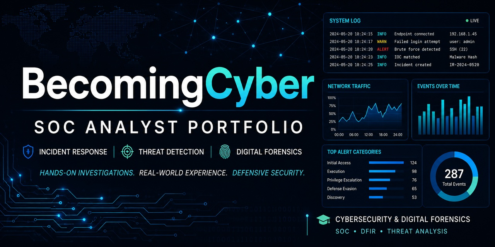

# BecomingCyber-SOC-Portfolio




A curated cybersecurity portfolio showcasing SOC analyst investigations, incident response exercises, threat detection workflows, log analysis, and defensive security projects.

---

## About This Repository

This repository serves as a central portfolio hub for my cybersecurity learning journey, connecting documented SOC analyst exercises, defensive security investigations, and hands-on security projects.

The goal is to transform cybersecurity training into demonstrable experience by documenting:

- Investigation methodology
- Tools used
- Analysis process
- Findings
- Lessons learned

---

## Skills Demonstrated

🛡️ Security Operations Center (SOC) Analysis  
📊 Log Analysis  
🔎 Incident Response  
🌐 Network Traffic Analysis  
🕵️ Threat Intelligence Analysis  
📁 Digital Forensics Concepts

---

## 📊 Technical Project Experience & SOC Portfolio

Projects below represent documented hands-on investigations completed as part of my cybersecurity training and portfolio development.

| Area | Project |
|------|---------|
| Azure Honeypot Detection Response | [Suspicious Bash Lab — Day 12](https://github.com/ObakengShuma/Azure--Honeypot-Detection-Response) |
| Security Monitoring and SIEM  | [Cron Job Persistence Lab — Day 13](https://github.com/ObakengShuma/Security-Monitoring-and-SIEM-Homelabs) |
| Phishing Analysis Lab | [PowerShell IR Lab — Day 14](https://github.com/ObakengShuma/Phishing-analysis-lab) |

---

## 🚀 Future Portfolio Expansion

Future labs will expand into:

- Cloud Security Monitoring
- Advanced SIEM Detection Engineering
- Digital Forensics Case Studies
- Security Automation Projects

---

## Tools

- Splunk
- Wazuh
- GitHub
- Security monitoring tools
- Azure

---

## Portfolio Categories

```text
BecomingCyber-SOC-Labs
│
├── SOC Investigations
│   └── Detection, monitoring, and investigation projects
│
├── Incident Response
│   └── Threat investigation and remediation workflows
│
├── Network Analysis
│   └── Traffic analysis and network investigations
│
├── Malware Analysis
│   └── Malware triage and IOC analysis
│
├── Windows & Endpoint Analysis
│   └── Windows troubleshooting, endpoint analysis, and system diagnostics
│
└── Security Automation
    └── Python and PowerShell security tooling
```

---

## 🎓 Certifications & Learning

Currently developing cybersecurity skills through:

- CompTIA Security+ Ongoing
- SOC analyst hands-on labs
- Incident response investigations
- Defensive security analysis
- Python and PowerShell security automation

---

## About Me

I am a Cybersecurity & Digital Forensics Analyst focused on Security Operations Center (SOC) analysis, incident response, digital forensics, and defensive security. I document hands-on labs and investigations to demonstrate practical cybersecurity skills.

[](https://github.com/BecomingCyber)

<a href="https://linkedin.com/in/mozella-mccoy-flowers">

</a>‎

<!--
**ObakengShuma/ObakengShuma** is a ✨ _special_ ✨ repository because its `README.md` (this file) appears on your GitHub profile.

Here are some ideas to get you started:
## Cyber Security & SOC Projects
- 🔭 I’m currently working on ...
- 🌱 I’m currently learning ...
- 👯 I’m looking to collaborate on ...
- 🤔 I’m looking for help with ...
- 💬 Ask me about ...
- 📫 How to reach me: ...
- 😄 Pronouns: ...
- ⚡ Fun fact: ...
-->
